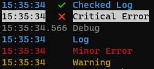

<br/>
<p align="center">
  <a href="https://github.com/LiamTownsley2/EasyLog">
    
  </a>

  <h3 align="center">EasyLog</h3>

  <p align="center">
    This is my simple logging package for creating simple, good looking CLI outputs.
    <br/>
    <br/>
    <a href="https://github.com/LiamTownsley2/EasyLog">View Demo</a>
    .
    <a href="https://github.com/LiamTownsley2/EasyLog/issues">Report Bug</a>
    .
    <a href="https://github.com/LiamTownsley2/EasyLog/issues">Request Feature</a>
  </p>
</p>

   

## Table Of Contents

* [About the Project](#about-the-project)
* [Built With](#built-with)
* [Getting Started](#getting-started)
  * [Installation](#installation)
* [Usage](#usage)
* [Roadmap](#roadmap)
* [Contributing](#contributing)
* [License](#license)
* [Authors](#authors)
* [Acknowledgements](#acknowledgements)

## About The Project



This is an example of the progam being executed, it gives a nice looking output with minimal effort.

## Built With

This was created with TypeScript. This is the only dependency.

## Getting Started

This is an example of how you may give instructions on setting up your project locally.
To get a local copy up and running follow these simple example steps.

### Installation

You can install this project with
```sh
npm install --save @liamtownsley/easylog
```

## Usage

```js
const { log, LogType } = require('@liamtownsley/easylog');

log("Checked Log", LogType.CHECKED_LOG);
log("Critical Error", LogType.CRITICAL_ERROR);
log("Debug", LogType.DEBUG);
log("Log", LogType.LOG);
log("Minor Error", LogType.MINOR_ERROR);
log("Warning", LogType.WARNING);
```

## Roadmap

See the [open issues](https://github.com/LiamTownsley2/EasyLog/issues) for a list of proposed features (and known issues).

## Contributing

Contributions are what make the open source community such an amazing place to be learn, inspire, and create. Any contributions you make are **greatly appreciated**.
* If you have suggestions for adding or removing projects, feel free to [open an issue](https://github.com/LiamTownsley2/EasyLog/issues/new) to discuss it, or directly create a pull request after you edit the *README.md* file with necessary changes.
* Please make sure you check your spelling and grammar.
* Create individual PR for each suggestion.
* Please also read through the [Code Of Conduct](https://github.com/LiamTownsley2/EasyLog/blob/main/CODE_OF_CONDUCT.md) before posting your first idea as well.

### Creating A Pull Request

1. Fork the Project
2. Create your Feature Branch (`git checkout -b feature/AmazingFeature`)
3. Commit your Changes (`git commit -m 'Add some AmazingFeature'`)
4. Push to the Branch (`git push origin feature/AmazingFeature`)
5. Open a Pull Request

## License

Distributed under the ISC License. See [LICENSE](https://github.com/LiamTownsley2/EasyLog/blob/main/LICENSE.md) for more information.

## Authors

* **[Liam Townsley](https://github.com/LiamTownsley2)**